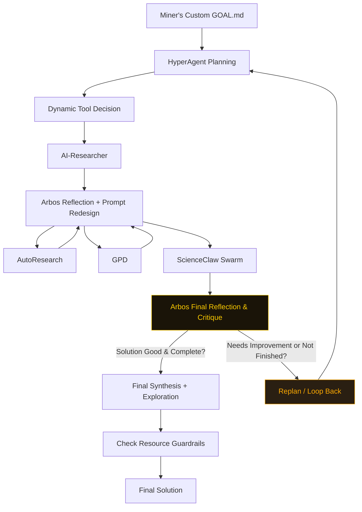

# ENIGMA MACHINE — Agentic Miner for Bittensor Subnet 63

**A high-performance reflective miner** powered by Arbos with strong miner control and adaptive looping.

### What Makes It Special

- Full GOAL.md strategy/context is read and **strongly injected** into every reflection and tool call
- Adaptive Quality Gate — Arbos scores novelty, verifier potential, and alignment before deciding to re-loop
- Smart auto-reloop when `miner_review_after_loop: false` (up to `max_loops`)
- MIT's ScienceClaw executed at the end of each loop
- Long-term memory via ChromaDB + resource-aware guardrails
- Uses Bittensor native compute and inference by default (Chutes, Targon, Lium)
- Professional Streamlit UI with plan approval and final miner review

### How the Ralph Loop Works



**Key Mechanics:**
- When `miner_review_after_loop: false` → Arbos runs multiple loops automatically and uses the quality gate to decide when to stop.
- When `miner_review_after_loop: true` → Miner reviews after every loop.
- Final review screen is **always** shown before submission.

### Tool Study & Mimicking Strategy

Complex tools are studied once by Arbos and stored as vector profiles. Arbos retrieves only the most relevant parts at runtime and mimics them intelligently. This keeps the loop fast and reliable. **ScienceClaw** is still called directly at the end of every loop for maximum scientific depth using the full context of the previous 3 tools output.

### Streamlit UI Highlights

- Challenge input + editable HyperAgent plan
- One-click "Run Tool Study Phase" button
- Debug/Trace mode
- Final miner review before submission

### Quick Start

```bash
git clone https://github.com/jbequ5/Enigma-Machine-Miner.git
cd Enigma-Machine-Miner
pip install -e .
cp .env.example .env
```

**One-time Setup**
```bash
python -c "from agents.tool_study import tool_study; tool_study.study_all_tools()"
```

**Launch**
```bash
streamlit run streamlit_app.py
```

### Starter GOAL.md Template

```markdown
GOAL: Solve the sponsor challenge with maximum novelty and verifier score while staying under 3.8h on H100.

STRATEGY/CONTEXT: [Your custom strategy, constraints, and success criteria here]

# Core Toggles
reflection: 4
exploration: true
resource_aware: true
guardrails: true

# Miner Control
miner_review_after_loop: false     # true = review after every loop
max_loops: 4
miner_review_final: true

# Compute
chutes: true
targon: false
celium: false
chutes_llm: mixtral
```

Ready to dominate SN63?

Fork the repo, run the Tool Study, write your strategy in GOAL.md, and start winning.

**$TAO 🚀**
