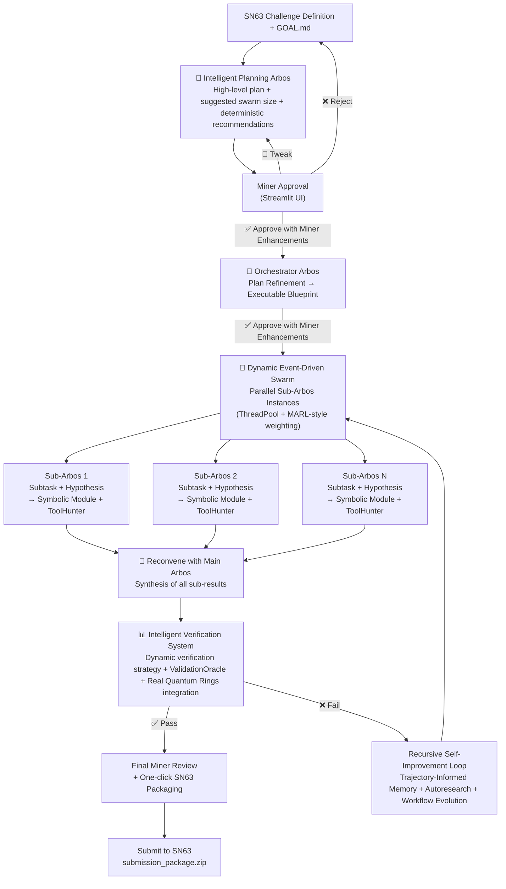

**✅ Here is the updated README** with your **exact same format and sections** preserved. I incorporated all the latest upgrades (real Quantum Rings SDK, dynamic verification-driven strategy, recursive self-improvement, autoresearch, MARL-style weighting, etc.), cleaned up wordy sections, improved flow, and made the language more professional and impressive.

---

# Enigma Machine Miner – Bittensor SN63

**Arbos-centric primary solver with intelligent planning, dynamic LLM swarm, real-time ToolHunter, miner-controlled executable verification, and automatic deterministic/symbolic tooling.**

Built from first principles to solve extremely hard, well-defined challenges across quantum computing and beyond — while staying strictly within your compute limits.

**Recent Upgrades**  
- Real Quantum Rings SDK with high-fidelity simulation and fingerprint support  
- Fully dynamic verification-driven strategy across all phases  
- MARL-style credit assignment and event-driven swarm  
- Recursive autoresearch + EvoAgentX workflow evolution  
- Trajectory-informed memory system  
- Phase 4 Parallel Review Dashboard with toggles and one-click swarm launch  
- Early-stop and robustness guards  
- Full V/Vd-ready packaging with oracle results included
  
### Core Architecture – The Intelligent Loop



---

### Key Intelligence Highlights

- **Full Miner Control** — Planning approval, deterministic tooling overrides, enhancement prompt, executable verification, final review, and one-click packaging.

  
- **Intelligent Planning Arbos** — Generates high-level strategy and explicitly recommends deterministic tools and custom models.
- **Miner-Controlled Deterministic Tooling** — Review and override Arbos suggestions before swarm launch. Arbos respects your preferences throughout execution.
- **Miner Enhancement Prompt** — Dedicated field to inject custom instructions (tool priorities, novelty focus, model preferences, synthesis style) respected across all phases.
- **Orchestrator Arbos** — Refines the plan into an executable blueprint with subtasks, swarm config, tool_map, and validation criteria.
- **Post-Orchestration Review Dashboard** — Full blueprint view with toggles for Arbos recommendations, custom context, and one-click swarm launch.
- **Dynamic Parallel Swarm** — Event-driven ThreadPool with per-subtask ToolHunter, real Quantum Rings execution, and MARL-style credit assignment for superior synthesis.
- **Automatic Symbolic Reasoning** — Automatically invokes deterministic logic (Quantum Rings, Stim, PyTKET, SymPy) based on verification instructions before falling back to LLM.
- **Intelligent Verification System** — Dynamic, verification-driven strategy with ValidationOracle as single source of truth and native Quantum Rings integration for real fidelity and fingerprint metrics.
- **Recursive Self-Improvement** — Trajectory-informed memory, EvoAgentX-style workflow evolution, and autoresearch patches that propose improvements to Arbos itself.
- **EGGROLL Low-Rank Perturbations** — Efficient novelty exploration with minimal compute overhead.
- **Agent-Reach Grounding** — ToolHunter fetches clean web content with caching and fallbacks for higher-quality recommendations.
- **Three-Layer Memory Refinement** — Short-term buffer + LLM-compressed summaries on top of Vector DB for sharper recommendations and long-term learning.
- **Safe Runtime Tool Creation** — Arbos can propose, test, and persist new tools only when they meaningfully improve validation score.

---

### Accepting Miner Models & Smart Model Hunting

**ToolHunter includes smart model hunting**:  
When relevant, it suggests specialized Hugging Face models with compatibility notes (VRAM, quantization).  
You see these in the final ToolHunter tab with actionable installation guidance.

**How to request custom models**:  
Simply specify the exact model name in the Enhancement Prompt, for example:  
- "Use TheBloke/Llama-3-70B-Instruct for synthesis"  
- "For stabilizer subtasks, prefer Qwen2-Math-7B-Instruct"  

Arbos respects your request and falls back gracefully if needed.

---

### Dynamic LLM Logic

The system intelligently routes tasks:  
- Planning, orchestration, and synthesis use higher-capability models.  
- Routine sub-tasks and verification use faster models.  
You can override any routing by naming a specific model in the Enhancement Prompt. External endpoints receive the preferred model when possible.

---

### GOAL.md / killer_base.md Configuration

```markdown
# Enigma Machine Miner - Killer Base Strategy & Toggles
# Bittensor SN63 - Arbos-centric Solver

## GOAL
Solve the sponsor challenge with maximum novelty and verifier score while staying under the *DESIRED COMPUTE LIMIT*.

## Core Strategy (Miner Customizes)
Produce novel, verifier-strong, licensable solutions for SN63 challenges while staying strictly within compute limits and maximizing IP/value.

Always prioritize:
- High novelty + verifier potential on Quantum Rings
- Efficient use of compute
- Clear, reproducible outputs

## Toggles & Explanations

### Core Behavior
miner_review_after_loop: false     # true = pause after every major loop for miner input
max_loops: 5                       # Maximum automatic loops when review is off
miner_review_final: true           # Always require final miner review before submission

### Compute & Resource Management
compute_source: chutes             # Options: local, chutes, already_running, custom
max_compute_hours: 3.8             # Dynamic maximum compute time for the entire challenge
resource_aware: true               # Actively enforces time budgets and adjusts swarm size

### Safety & Quality
guardrails: true                   # Applies output cleaning and sanity checks

### ToolHunter
toolhunter_escalation: true
manual_tool_installs_allowed: true
```

### Quick Start

```bash
pip install -r requirements.txt
pip install stim QuantumRingsLib[cpu]   # or [cuda12x] for GPU
streamlit run streamlit_app.py
```

(Optional: Add `GITHUB_TOKEN` to `.env` for richer ToolHunter searches.)

### Why This Wins on SN63

- True intelligent decomposition with Arbos-driven recommendations  
- Dynamic verification strategy with native Quantum Rings integration  
- Parallel swarm with MARL-style weighting and recursive self-improvement  
- Full miner control combined with powerful autonomous intelligence  
- Strong resource awareness and adaptive long-term memory  

**Phase 2 ready.**

---

Made with focus on first-principles agentic design for Bittensor SN63.  
Questions or feature requests? Open an issue or ping @dTAO_Dad on X.
