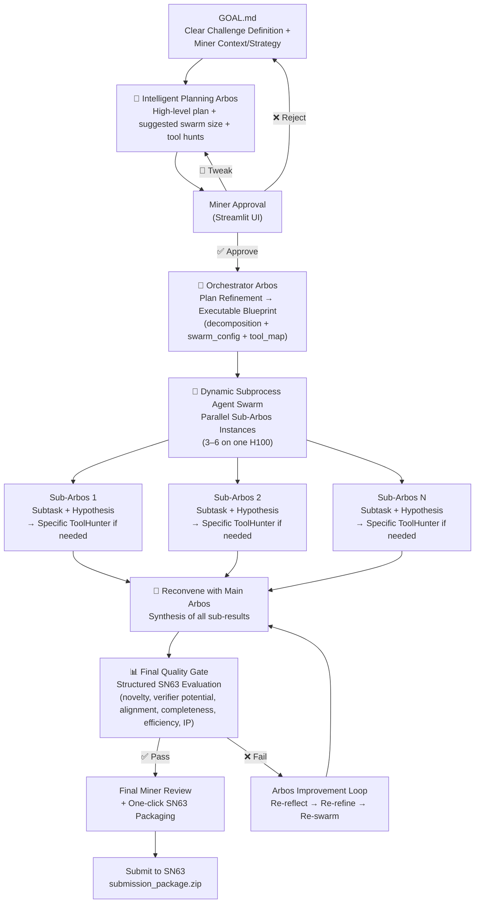

# Enigma Machine Miner – Bittensor SN63

**Arbos-centric primary solver with intelligent planning, dynamic swarm, and real-time ToolHunter**

The most intelligent and resource-efficient miner on Subnet 63 (Quantum Innovate / qBitTensor Labs). Designed from first principles to solve extremely hard, well-defined computational challenges across quantum and any industry — within the strict ~4-hour H100 limit.

### Core Architecture – The Intelligent Loop



**Key Intelligence Highlights**
- **Intelligent Planning Arbos** creates the high-level strategy and swarm guidance.
- **Orchestrator Arbos** intelligently breaks the problem into subprocesses with a precise `tool_map` per subtask.
- **Subprocess Agent Swarm** runs true parallel exploration, with **subtask-specific ToolHunter** calls when gaps are detected.
- **Main Arbos Reconvene** synthesizes results intelligently.
- **Adaptive Re-loop Decision** at the quality gate keeps the system reflective and self-improving until the solution passes or the compute budget is reached.
  
### How ToolHunter Works

ToolHunter is a **dynamic meta-tool** that allows the swarm to discover, evaluate, and integrate new tools on-the-fly when the current solution has a knowledge or capability gap.

**Process**:
1. A sub-Arbos detects a gap during its mini-reflection (or the blueprint `tool_map` flags it).
2. ToolHunter generates precise search queries and performs real searches on GitHub and arXiv.
3. It ranks candidates by relevance, GPU-friendliness, and SN63/Quantum Rings compatibility.
4. It attempts safe cloning and basic testing in a temporary sandbox (with timeouts).
5. **Success** → Returns integration code + patch. The tool is stored in long-term memory for future reuse.
6. **Failure** (dependency issues, build errors, etc.) → Generates a clear **miner escalation recommendation** with copy-paste commands, risks, and a suggested wrapper. This appears prominently in the final review screen.

This keeps the system autonomous where possible while intelligently escalating hard cases to the miner.


### GOAL.md / killer_base.md Configuration

Your main strategy and control file is **`goals/killer_base.md`**. It is injected at every stage (Planning Arbos, Orchestrator Arbos, reflections, and quality gates).

#### Main Toggles & Explanations

- **`exploration:`** (default: true)  
  Enables the exploration module to generate novel variants after synthesis.

- **`resource_aware:`** (default: true)  
  Activates compute monitoring and early abort if approaching the 3.8h H100 limit.

- **`guardrails:`** (default: true)  
  Applies safety checks and output sanitization.

- **`miner_review_after_loop:`** (default: false)  
  If `true`, pauses after each loop for miner review. If `false`, Arbos auto-reloops intelligently (up to `max_loops`).

- **`max_loops:`** (default: 5)  
  Maximum number of improvement loops before forcing finalization.

- **`miner_review_final:`** (default: true)  
  Always requires a final miner review before packaging/submission (recommended for prize submissions).

- **`chutes:`** (default: true)  
  Enables dynamic routing to external compute (Chutes/Celium) for heavy tasks.

- **`chutes_llm:`** (default: "mixtral")  
  Which LLM to use when routing via Chutes.

Additional sections you can add to `killer_base.md`:
- `# Miner Control` — custom instructions for human oversight.
- `# Compute` — specific resource limits or routing preferences.
- `# Strategy` — detailed SN63 success criteria, novelty guidelines, Quantum Rings integration notes, etc.

The full content of `killer_base.md` is loaded at startup and strongly injected into every Arbos decision.

### Quick Start

```bash
pip install -r requirements.txt
streamlit run streamlit_app.py
```

(Optional: Add `GITHUB_TOKEN` to `.env` for richer ToolHunter searches.)

### Why This Wins on SN63

- True **intelligent decomposition** via Planning + Orchestrator Arbos
- Parallel hypothesis exploration with per-subtask ToolHunter
- Closed-loop reflection and re-looping at the quality gate
- Full transparency and miner control at every critical decision
- Self-improving via contextual and long-term memory

**Phase 2 ready.**

---

Made with focus on first-principles agentic design for Bittensor SN63.  
Questions or feature requests? Open an issue or ping @dTAO_Dad on X.
