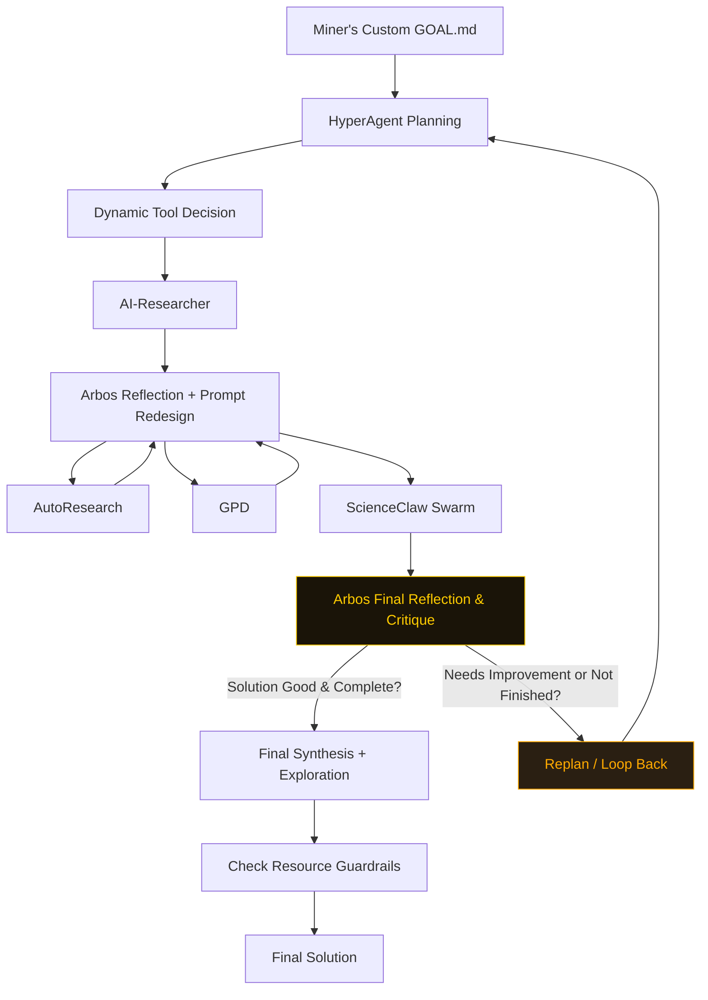

# ENIGMA MACHINE — Agentic Miner for Bittensor Subnet 63

**A high-performance, human + agentic problem solving engine** 

Powered by Arbos + Sequential tool chaining + Reflection after every tool.


### Core Philosophy
Everything is optional and controlled from `GOAL.md`.  

The miner uses **Arbos** as the intelligent conductor, dynamically decides which open source tools to use, reflects after every step, repeats loop until solution or compute limits are met.

### How the Ralph Loop Works

1. Miner Customizes GOAL.md File with Challenge + Strategy
2. File goes to HyperAgent for Planning - Must be Approved by Miner
3. Arbos decides which tools to run
4. Arbos decides which compute option to use for execution
5. **Reflects and Redesigns** the prompt for the next tool
6. **ScienceClaw** agent swarm runs at the end of the chain with cumulative context
7. **Optional** Miner Review before Looping again
8. **Final Arbos Critique** — if the solution needs improvement, loop back to replanning
9. Final Miner Review before Submission
10. Results saved to long-term memory for future challenges.

This tight loop makes the miner highly adaptive and capable of continuous self-improvement.

### Key Features

- Sequential Tool Chain with reflection + prompt redesign **after every tool**
- Tool Study + Vector Retrieval for High-Fidelity Tool Mimicking
- Cumulative Context via `program.md`
- Dynamic Reflection Depth based on Cost/Token Awareness
- Resource-Aware Guardrails + Auto-Compression
- Exploration Module For Deeper and more Novel Ideas

### Tool Study & Tool Replication Strategy

**Why we use Tool Study + Mimic instead of direct wrappers:**

Many of the powerful open-source tools (AI-Researcher, AutoResearch, GPD, HyperAgent) are complex, have heavy dependencies, or are not designed for reliable repeated calls inside a tight miner loop.

Instead of fragile direct wrappers that often break or slow down the system, we do the following:

1. **One-time Tool Study Phase** — Arbos reads each tool’s repository, extracts its purpose, workflow, strengths, and limitations.
2. **2-Pass Self-Refinement** — The initial profile is critiqued and improved with a focus on “Improvement Potential for Enigma Miner.”
3. **Vector Storage** — Profiles are chunked and stored in a ChromaDB vector database.
4. **Real-time Retrieval** — During runtime, Arbos pulls only the *most relevant* parts of each profile based on current context.

**Benefits:**
- Keeps the main reflection loop extremely tight and fast
- Avoids dependency hell and runtime errors from external CLIs
- Allows Arbos to intelligently mimic the unique strengths of each tool
- Enables dynamic, context-aware behavior without breaking the 4-hour H100 limit
- Real ScienceClaw is still called directly at the end of every loop for maximum scientific depth

This hybrid approach (mimic first three tools + real ScienceClaw) gives us the best of both worlds: reliability + performance + true tool capability.

### Architecture Overview



### Quick Start

```bash
git clone https://github.com/jbequ5/Enigma-Machine-Miner.git
cd Enigma-Machine-Miner
pip install -e .
cp .env.example .env
```

#### One-time Setup
```bash
# Build intelligent tool profiles (run once)
python -c "from agents.tool_study import tool_study; tool_study.study_all_tools()"
```

#### Launch the Miner
```bash
streamlit run streamlit_app.py
```

### Streamlit UI Highlights

- Challenge input + HyperAgent planning
- Human-in-the-loop plan approval
- One-click **"Run Tool Study Phase"** button
- Debug/Trace Mode (shows reflection steps, profiles used, compute chosen)
- Automatic GOAL.md generation

### Killer GOAL.md Template

```markdown
GOAL: Solve the sponsor challenge with maximum novelty and verifier score while staying under 3.8h on H100.

reflection: 4
planning: true
hyper_planning: true
exploration: true
resource_aware: true
guardrails: true

# Compute
chutes: true
targon: false
celium: true
chutes_llm: User Choice
```

### Ready to Dominate SN63?

Fork the repo, run the Tool Study, launch the UI, and start winning.

**$TAO 🚀**
