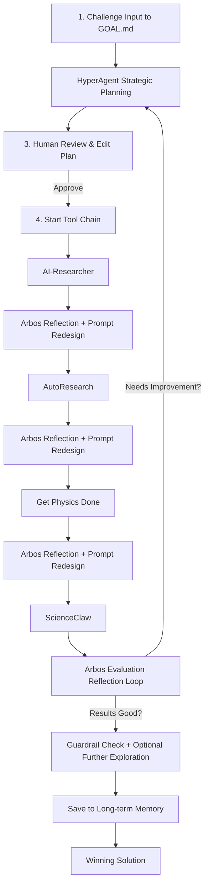

# Enigma Machine Miner — Bittensor Subnet 63

**A highly controllable, agentic solving system for Enigma (SN63)**

Built with **real Arbos**, **sequential tool chaining**, **reflection after every tool**, and **long-term memory**.

---

### Core Philosophy

Everything is **optional** and controlled from a single `GOAL.md` file.  

The miner uses a **cumulative, reflective** workflow where each tool builds directly on the previous one through Arbos critique and prompt redesign.

### Key Features

- **Human-in-the-Loop Strategic Planning** — HyperAgent generates a plan → you review, edit, and approve
- **Reflection + Prompt Redesign after EVERY tool** — Arbos critiques output and rebuilds the prompt for the next tool
- **Dynamic Compute Routing** — Arbos recommends the best backend (Chutes / Targon / Celium / local) per tool
- **Cumulative Context** — `program.md` maintains running memory within a run
- **Long-term Memory** — Persistent knowledge base across multiple challenges (Chroma)
- **H100 Guardrails** — Real runtime monitoring + auto-compression before 4-hour limit
- **Real Compute Subnets** — Chutes + Targon + Celium with Chutes LLM picker
- **Enigma-themed Streamlit UI** — Feels like operating a real WWII Enigma machine

### Tool Chain (Sequential & Cumulative)

1. **AI-Researcher** (facebookresearch)— Broad search and discovery  
2. **AutoResearch** (Karpathy) — Deep iterative literature synthesis 
3. **GPD** (Get Physics Done) — Rigorous physics and theoretical modeling  
4. **ScienceClaw** (MIT) — Final deep analysis and synthesis  

**After each tool**, Arbos performs reflection, redesigns the prompt, and can recommend optimal compute.

### How the Tools Work Together
The miner follows a **sequential, cumulative** workflow with strong Arbos reflection:


### Quick Start

```bash
git clone https://github.com/jbequ5/Enigma-Machine-Miner.git
cd Enigma-Machine-Miner
pip install -e .
cp .env.example .env
```

Edit `.env` with your API keys (OpenAI, Anthropic, etc.).

**Launch the UI:**

```bash
streamlit run streamlit_app.py
```

**Or run headless:**

```bash
python -m agents.arbos_manager
```

### Folder Structure

```
agents/
├── arbos_manager.py          # Core conductor
├── memory.py                 # Long-term memory (Chroma)
└── tools/
    ├── autoresearch/
    ├── hyperagent/
    ├── get_physics_done/
    ├── ai_researcher/
    ├── scienceclaw/
    ├── compute.py
    ├── resource_aware.py
    ├── guardrails.py
    └── exploration.py
```

### GOAL.md Template (Killer Base)

```markdown
GOAL: Solve the sponsor challenge with maximum novelty and verifier score while staying under 3.8h on H100.

reflection: 4
planning: true
hyper_planning: true
multi_agent: true
swarm_size: 20
exploration: true
resource_aware: true
guardrails: true

# Compute + LLM
chutes: true
targon: false
celium: true
chutes_llm: mixtral
```

Everything is controlled from this file.

---

**Ready to dominate Enigma?**

Fork the repo, customize your `GOAL.md`, approve plans in the UI, and let the reflection loop + long-term memory turn your miner into a compounding intelligence.

$TAO 🚀
```
