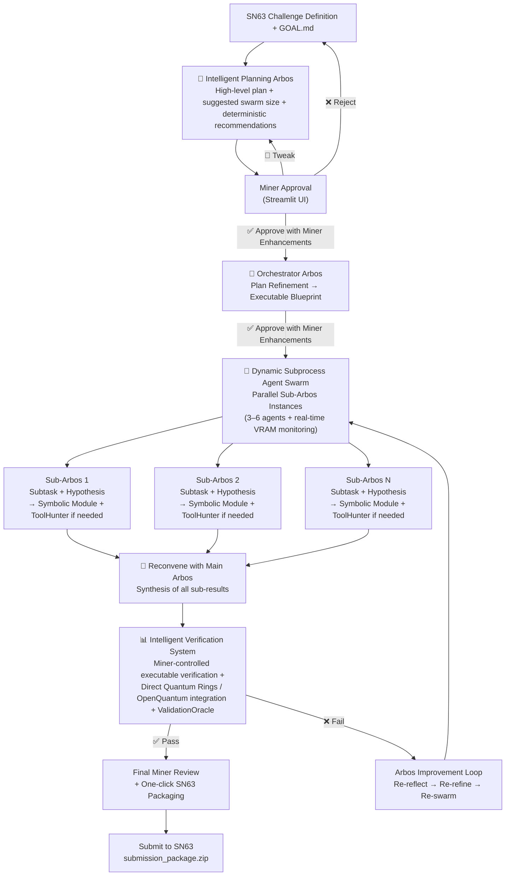

# Enigma Machine Miner – Bittensor SN63

**Arbos-centric primary solver with intelligent planning, dynamic LLM swarm, VRAM monitoring, real-time ToolHunter, miner-controlled executable verification, and automatic deterministic/symbolic tooling.**

The most intelligent and resource-efficient solo miner on Subnet 63 (Enigma). 

Built from first principles to solve extremely hard, well-defined challenges across quantum computing and any industry — while staying strictly within your compute limit.

### Core Architecture – The Intelligent Loop


### Production 11-Step Flow – The Enigma-Machine-Miner Double-Loop Engine

This system is purpose-built for SN63: it treats the **official ValidationOracle** as the single source of truth, uses EGGROLL for efficient exploration, Agent-Reach for grounded decisions, and gives the miner full control while remaining highly autonomous and compute-efficient.

1. **Phase 1: Recommended Tools (Trigger)**  
   Main Arbos runs ToolHunter on GOAL.md (which includes the official validator path). It returns concrete tool and model recommendations. Miner reviews and applies/skips. Validation oracle reference is loaded.

2. **Phase 2: Intelligent Planning**  
   Arbos generates a high-level plan, suggested swarm size, compute rules, and a Validation Oracle summary. Miner approves or tweaks with a custom enhancement prompt.

3. **Phase 3: Executable Blueprint**  
   Orchestrator Arbos creates a concrete subtask breakdown, tool assignments, symbolic-first rules, VRAM budgets, and a clear validation oracle integration plan.

4. **Phase 4: Post-Orchestration Review Dashboard (Parallel View)**  
   A single, powerful screen shows the full blueprint, swarm dynamics, and **Validation Oracle Summary**. Miner sees Arbos Recommended patterns (from Vector DB), backup suggestions, and an "Add My Context" form — each with toggles and evidence. Action bar: “Pass All / Use Original” or **Encode & Launch Swarm**.

5. **Phase 5: Dynamic Swarm Execution**  
   3–6 Sub-Arbos run in parallel using symbolic-first logic and ToolHunter for gaps. Real-time VRAM monitoring and EGGROLL low-rank perturbations keep exploration efficient.

6. **Phase 6: Reconvene**  
   Main Arbos synthesizes all sub-results into a candidate solution. No automatic pause — flow continues unless miner-configured.

7. **Phase 7: ATLAS Inner-Loop (Autonomous)**  
   `generate_self_tests()` + multi-hypothesis generation with EGGROLL perturbations. Tests run silently. Failures trigger a repair loop (max 3 attempts). All actions are benchmarked against the ValidationOracle.

8. **Phase 8: Verification (Oracle-Centric)**  
   Full verification runs the **official miner validation code** from GOAL.md locally. Returns structured `validation_score`, fidelity, and V/Vd readiness. If “pause on verification” is enabled, miner reviews; otherwise the system continues autonomously.

9. **Phase 9: TrajectoryRL Outer-Loop (Always Runs)**  
   Every trajectory is stored and embedded in the Vector DB (single source of truth). Self-critique generates strategy updates and meta-prompt deltas. High-validation-score patterns are automatically surfaced as Arbos Recommended on the next loop.

10. **Phase 10: Loop Decision**  
    Early-stop triggers if validation_score falls below threshold after 2 loops (configurable). If the solution passes the oracle and loops remain, the system returns to Phase 5. Otherwise it moves to improvement → refined blueprint → Phase 4.

11. **Phase 11: Final Review & Packaging**  
    Solution + full oracle results are displayed. One-click **Package for SN63** creates a clean V/Vd-formatted zip containing the solution, blueprint, trace, miner notes, and `validation_oracle.json`. Session ends.
---

### Key Intelligence Highlights

- **Full Miner Control** — Planning approval, deterministic tooling field, executable verification, custom LLM requests, enhancement prompt, final review, and one-click packaging.
- **Intelligent Planning Arbos** — Generates high-level strategy and explicitly recommends deterministic tools and custom HF models (Stim, Quantum Rings, PyTKET, SymPy, or models like Llama-3-70B and Qwen2-Math).
- **Miner-Controlled Deterministic Tooling** — Miner can review Arbos suggestions and add/override tooling or model requirements before the swarm starts.
- **Miner Enhancement Prompt** — Dedicated field to inject custom instructions (tool priorities, novelty focus, model preferences, synthesis style, etc.) that Arbos respects throughout the run.
- **Orchestrator Arbos** — Refines the plan into an executable blueprint with subtasks, swarm config, tool_map, and model assignments.
- **Dynamic Parallel Swarm with per-subtask ToolHunter** — Each Sub-Arbos explores hypotheses independently and calls ToolHunter for gaps. Tool acquisiton failures are clearly shown in the final ToolHunter tab with actionable fixes.
- **Automatic Symbolic Reasoning** — Automatically invokes deterministic logic (stabilizers, fidelity, circuit optimization, preprocessing) before falling back to LLM.
- **Intelligent Verification System** — Supports custom executable code including direct Quantum Rings and OpenQuantum integration for real, deterministic metrics. Now powered by **ValidationOracle** as the single source of truth.
- **Adaptive Re-loop & Memory** — Strong long-term memory with meta-reflection on failures, making the miner more effective over time.
- **New: EGGROLL Low-Rank Perturbations** — Efficient exploration in the inner loop for better novelty with lower compute cost.
- **New: Agent-Reach Grounding** — ToolHunter now automatically fetches clean web content with caching and fallbacks for higher-quality recommendations.
- **New: Phase 4 Post-Orchestration Review Dashboard** — Parallel view with blueprint, Validation Oracle summary, toggles for Arbos Recommended (Vector DB) and custom context, plus "Encode & Launch Swarm".

---

### Miner Enhancement Prompt (Make this a 10/10 run)

In the planning approval screen there is a dedicated field titled **"🚀 Miner Enhancement Prompt (Make this a 10/10 run)"**.

Use it to give Arbos custom guidance such as:
- Tool priorities or constraints
- Focus areas (novelty, verifier strength, IP potential, efficiency)
- Synthesis preferences
- Specific model requests (e.g. "Use TheBloke/Llama-3-70B-Instruct for synthesis")
- Any other challenge-specific instructions

These instructions are injected into refinement and synthesis.

---

### Miner-Controlled Deterministic Tooling

- Planning Arbos shows clear recommendations.  
- You can immediately add or edit **Deterministic Tooling Requirements** (e.g., "Use stim for stabilizers. Run fidelity on Quantum Rings.").  
- You get time to install recommended tools before the swarm launches.  
- Arbos then automatically uses the symbolic module and respects your preferences.

---

### Accepting Miner Models & Smart Model Hunting

**ToolHunter includes smart model hunting**:  
- When relevant, it searches Hugging Face for specialized models and returns the name + compatibility notes (VRAM, quantization options).  
- You see these in the final ToolHunter tab with manual action suggestions (e.g., “Use 4-bit version” or “Rent larger GPU”).

**How to request custom models**:  
- Simply write the exact model name in the Enhancement Prompt, for example:  
- "Use TheBloke/Llama-3-70B-Instruct for synthesis"  
- "For stabilizer subtasks, prefer Qwen2-Math-7B-Instruct"  

Arbos respects your request. If the compute provider cannot load it, the system falls back gracefully and logs a clear warning.

---

### Dynamic LLM Logic

The system uses a smart **LLM Router** that chooses the right model for each task:  
- High-novelty, planning, orchestration, synthesis → "best" models  
- Routine sub-tasks, verification, ToolHunter → "fast" models  
- You can override any choice by naming a specific model (including HF models) in the Enhancement Prompt.  
- External endpoints receive the `preferred_model` field so they can attempt to load it.

---

### GOAL.md / killer_base.md Configuration

```markdown
# Enigma Machine Miner - Killer Base Strategy & Toggles
# Bittensor SN63 - Arbos-centric Solver

## GOAL
Solve the sponsor challenge with maximum novelty and verifier score while staying under the *DESIRED COMPUTE LIMIT*.

## Core Strategy (Miner Customizes)
Produce novel, verifier-strong, licensable solutions while staying within compute limits and maximizing IP/value.

## Toggles & Explanations

### Core Behavior
miner_review_after_loop: false     # true = pause after every major loop
max_loops: 5
miner_review_final: true

### Compute & Resource Management
compute_source: chutes             # Options: local, chutes, already_running, custom
max_compute_hours: 3.8
resource_aware: true               # Enforces time budgets and adjusts swarm size

### Safety & Quality
guardrails: true

### ToolHunter
toolhunter_escalation: true
manual_tool_installs_allowed: true

### Swarm Efficiency (vLLM only for local)
tensor_parallel_size: 1            # Only affects local compute
vllm_model: mistralai/Mistral-7B-Instruct-v0.2
```

### Quick Start

```bash
pip install -r requirements.txt
pip install vllm                    # Strongly recommended
streamlit run streamlit_app.py
```

(Optional: Add `GITHUB_TOKEN` to `.env` for richer ToolHunter searches. Install `stim`, `qiskit`, `pytket`, or `quantumrings` as needed.)

### Why This Wins on SN63

- True intelligent decomposition with Arbos-driven recommendations
- Parallel per-subtask ToolHunter + automatic symbolic reasoning reduces LLM reliance
- Miner-controlled verification with direct Quantum Rings/OpenQuantum support
- Full control over tooling, models, and instructions
- Strong resource awareness and adaptive memory

**Phase 2 ready.**

---

**Recent Upgrades**  
- **ValidationOracle** as single source of truth for scoring  
- **EGGROLL** low-rank perturbations for efficient exploration  
- **Agent-Reach** with caching + fallbacks for grounded ToolHunter  
- **Phase 4 Parallel Review Dashboard** with toggles and "Encode & Launch Swarm"  
- **Early-stop** and `max_repair_attempts` robustness guards  
- Full V/Vd-ready packaging with oracle results included  

Made with focus on first-principles agentic design for Bittensor SN63.  
Questions or feature requests? Open an issue or ping @dTAO_Dad on X.
```
