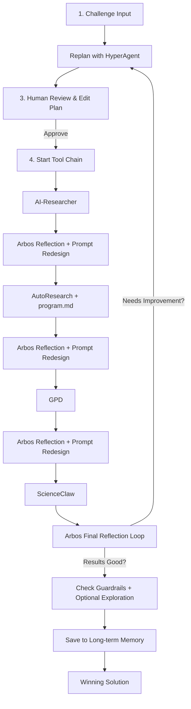

# Enigma Machine Miner — Bittensor SN63

**A beautiful, controllable, agentic miner for Subnet 63 (Enigma)**

Powered by **real Arbos** + **sequential tool chain** + **reflection after every tool** + **long-term memory**.

---

### Core Features

- **Human-in-the-Loop Strategic Planning**: HyperAgent creates a detailed plan → you review and approve
- **Reflection + Prompt Redesign after every tool**: Arbos critiques output and rebuilds the prompt for the next tool
- **Cumulative Memory**: `program.md` is updated after each tool and passed forward
- **Long-term Memory**: Persistent knowledge base across runs (Chroma)
- **Strategic Tool Control**: The plan decides how much compute each tool gets (depth, iterations, profile, tier, etc.)
- **Real Compute Guardrails**: Runtime monitoring + auto-compression before a set compute limit
- **Real Compute Routing**: Chutes + Targon + Celium with Chutes LLM picker
- **Enigma-themed Streamlit UI**: Feels like operating a real WWII Enigma machine

### Tool Chain (Sequential & Cumulative)

1. **AI-Researcher** — Broad search and discovery
2. **AutoResearch** (karpathy) — Deep iterative literature synthesis 
3. **GPD** (Get Physics Done) — Rigorous physics / theoretical modeling
4. **ScienceClaw** — Final deep analysis and cross-referencing

**After each tool**, Arbos performs reflection and redesigns the prompt for the next tool while preserving the original goal.

### Quick Start

```bash
git clone https://github.com/jbequ5/Enigma-Machine-Miner.git
cd Enigma-Machine-Miner
pip install -e .
cp .env.example .env
```

Edit `.env` with your API keys (OpenAI, Anthropic, etc.).

**Launch the UI:**

```bash
streamlit run streamlit_app.py
```

**Or run headless:**

```bash
python -m agents.arbos_manager
```

### How the Patterns Work Together

The miner follows a **sequential, cumulative** workflow with strong Arbos reflection:



### Folder Structure

```
agents/
├── arbos_manager.py          # Core conductor
├── memory.py                 # Long-term memory (Chroma)
└── tools/
    ├── autoresearch/
    ├── hyperagent/
    ├── get_physics_done/
    ├── ai_researcher/
    ├── scienceclaw/
    ├── compute.py
    ├── resource_aware.py
    ├── guardrails.py
    └── exploration.py
```

### GOAL.md Template (Killer Base)

```markdown
GOAL: Solve the sponsor challenge with maximum novelty and verifier score while staying under 3.8h on H100.

reflection: 4
planning: true
hyper_planning: true
multi_agent: true
swarm_size: 20
exploration: true
resource_aware: true
guardrails: true

# Compute + LLM
chutes: true
targon: false
celium: true
chutes_llm: mixtral
```

Everything is controlled from this file.

---

**Ready to dominate Enigma?**

Fork the repo, customize your `GOAL.md`, approve plans in the UI, and let the reflection loop + long-term memory turn your miner into a compounding intelligence.

$TAO 🚀
```
